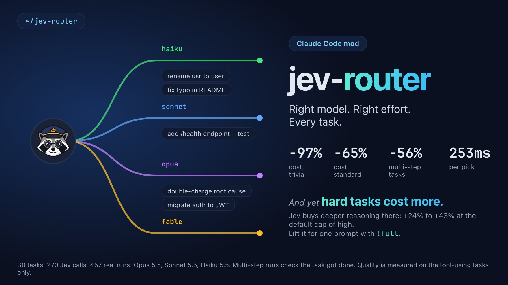
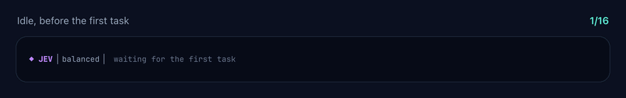
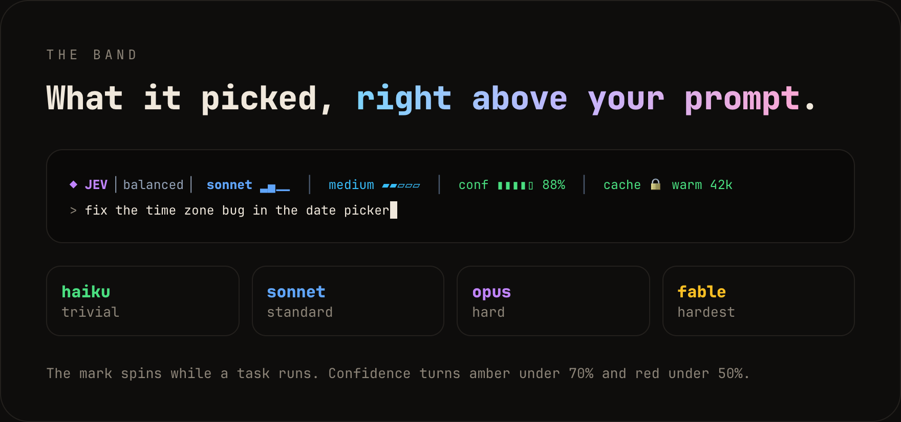
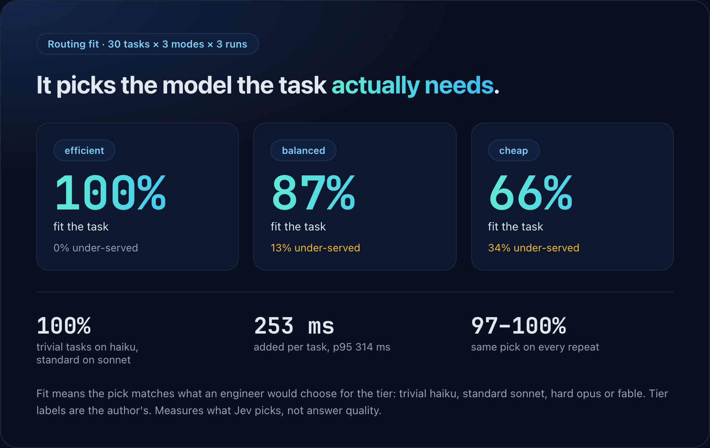
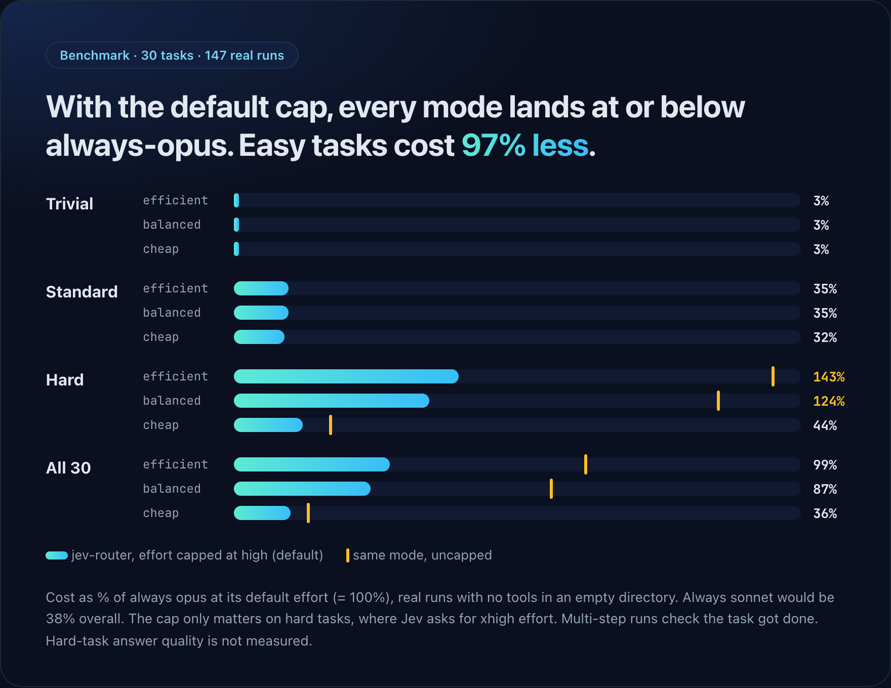
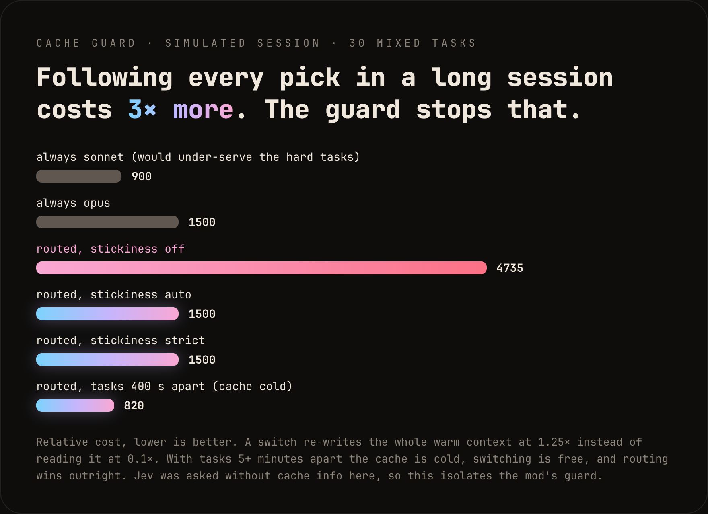
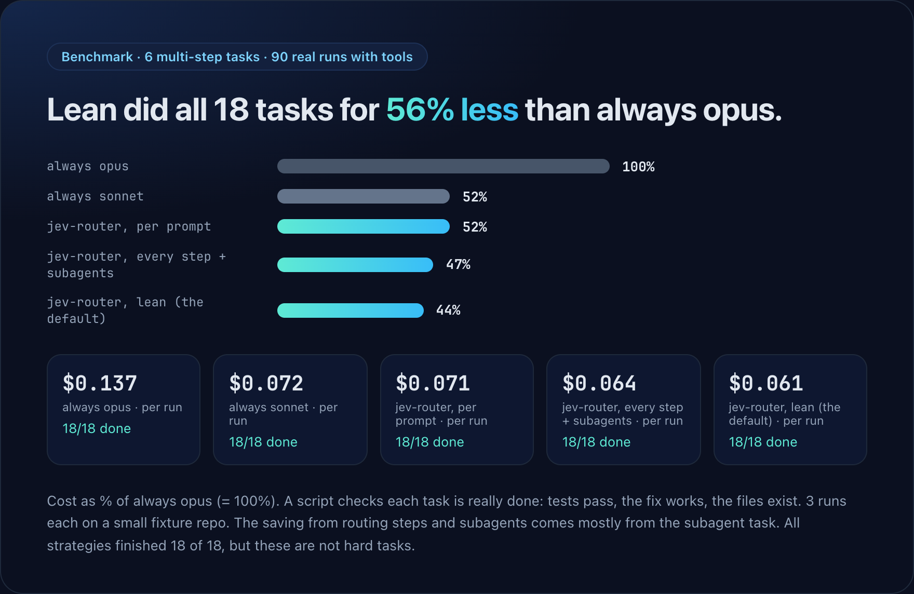
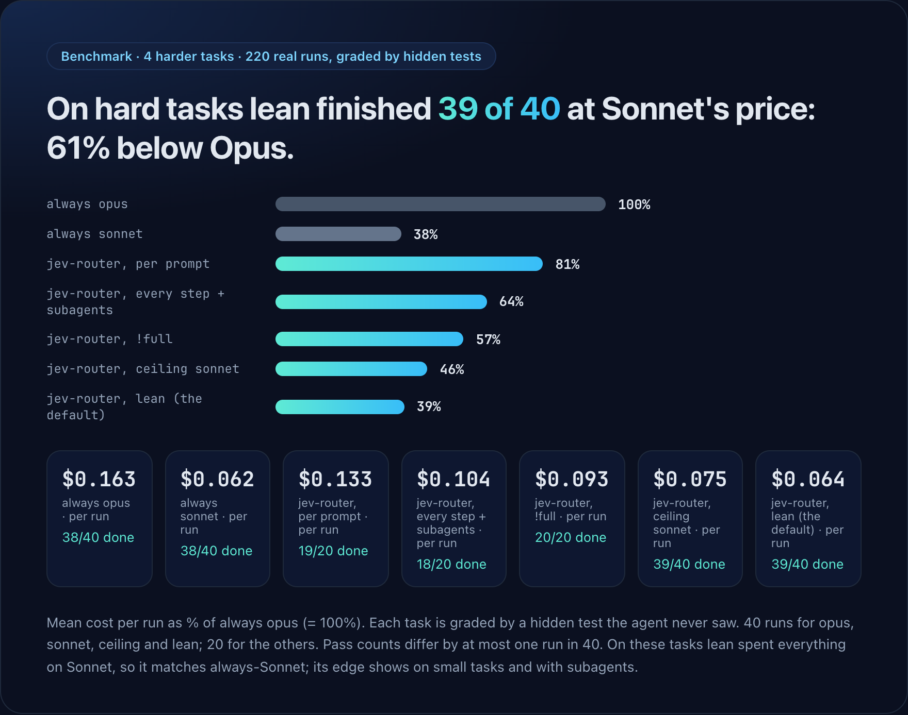
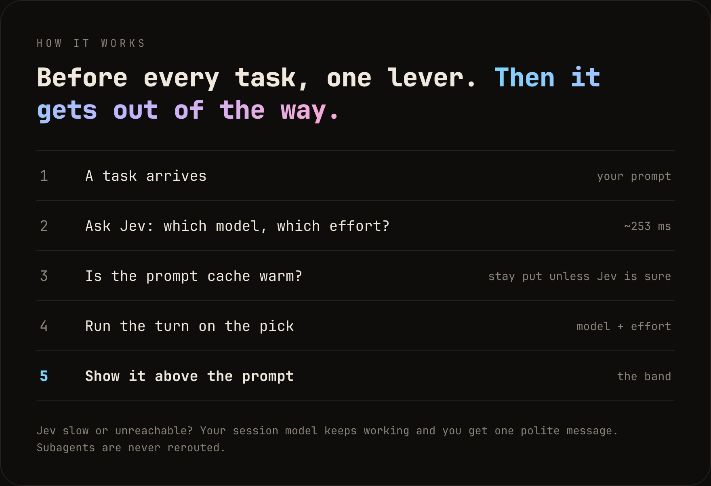

<p align="center">
  
</p>

<h1 align="center">jev-router: automatic Claude model routing for Claude Code</h1>

<p align="center">
  <em>Switch between Opus, Sonnet and Haiku automatically. He pulls one lever; your task rides the right track.</em>
</p>

<p align="center">
  
  
  
  
</p>

<p align="center">
  
</p>

<p align="center">
  <a href="https://dominicrico.github.io/jev-router/">Website</a> ·
  <a href="#install-the-claude-code-plugin">Install</a> ·
  <a href="#does-it-reduce-claude-code-costs">Benchmarks</a> ·
  <a href="#faq">FAQ</a> ·
  <a href="CHANGELOG.md">Changelog</a>
</p>

---

**jev-router is a free, open-source Claude Code plugin that routes every prompt, step and subagent to the right Claude model (Haiku, Sonnet, Opus, Fable) and the right reasoning effort.** It asks [TypeSafe Jev](#how-it-works) which model a task needs, caps the effort so hard tasks do not burn tokens, protects your prompt cache from needless model switches, and shows the choice in a live status band above the prompt. Use it to cut Claude Code cost on easy work without giving up Opus when a task needs it.

## Where jev-router shines

If your default is Opus, most of your prompts pay for more model than they need. A rename does not need the model that designs your queue. Measured with real Claude Code runs, against **always using Opus**:

| Your work | What jev-router does | Result |
| --- | --- | --- |
| Small tasks: renames, typos, lookups, version bumps | Haiku at low effort | **−97% cost** |
| Everyday features, tests and refactors | Sonnet | **−65% cost** |
| Multi-step agent runs with tools and subagents | Re-routes each step, picks a model per subagent | **18/18 done at 47% of the cost** |
| Hard tasks, graded by hidden tests (the default `lean` preset) | Sonnet, effort `medium`, Opus only when Jev is 90% sure | **39/40 done at $0.064 per run vs $0.163 (−61%)** |
| A mixed bag of 30 tasks (single prompts, `balanced` preset) | Effort capped at `high` | **−1% to −64%** by mode, never above Opus |

**Out of the box (0.4.0)** jev-router runs the `lean` preset: a Sonnet ceiling and effort capped at `medium`. Want the old behaviour? `/jev preset balanced` or set the `preset` option. [Presets](#presets).

**Best for:** Opus-by-default users, mixed workloads full of small prompts, agent runs with subagents, and anyone who wants to *see and steer* which model runs (the band, `!opus`, `!full`, `/jev ceiling`).

**Not for:** long sessions on one big warm context. There, routing cost +24% against Opus even with the cache guard, because switching models re-writes the cache; the default `lean` preset already holds Jev to Sonnet, and plain Sonnet is the other safe choice (the +24% was measured with the older `balanced` settings). And if plain Sonnet already does all your work, it is cheaper than routing. Every figure above comes from the [benchmarks](#does-it-reduce-claude-code-costs), including the ones that went against it.

### Install in 30 seconds

```
/plugin marketplace add dominicrico/jev-router
/plugin install jev-router@jev-router
```

Then `/jev key <your TypeSafe key>` and `/jev status`. Full setup in [Install](#install-the-claude-code-plugin).

You know the problem: you rename one variable and your most expensive model thinks about it for a minute. jev-router puts a switchman in front of your session. Before every task he reads it, asks Jev, pulls the lever, and the turn runs on the model and effort that fit.

**Contents:** [Where it shines](#where-jev-router-shines) · [Status band](#the-status-band) · [Features](#features-model-routing-effort-cap-cache-guard-subagents) · [Does it reduce costs?](#does-it-reduce-claude-code-costs) · [How it works](#how-it-works) · [Install](#install-the-claude-code-plugin) · [Commands](#commands) · [Options](#options) · [Privacy](#privacy) · [FAQ](#faq)

## The status band

A live Claude Code status band above your prompt shows which model and effort were picked. Colour coded, with a spinner while a task runs.

<p align="center">
  
</p>

<p align="center">
  
</p>

| Part | Meaning |
| --- | --- |
| `balanced` | Routing mode: `efficient`, `balanced` or `cheap` |
| `sonnet ▂▄__` | The model the task runs on, with its tier. Green haiku, blue sonnet, purple opus, gold fable |
| `medium ▰▰▱▱▱` | Reasoning effort, `low` to `max` |
| `conf ▮▮▮▮▯ 88%` | How sure Jev is. Green from 70%, amber from 50%, red below |
| `cache 🔒 warm 42k` | Whether the prompt cache is still worth protecting, and how big it is |

When the cache wins, the band says so: `opus (kept 🔒 cache warm; wanted haiku)`.

## Features: model routing, effort cap, cache guard, subagents

- **Picks the model and the effort**, before every task, from haiku, sonnet, opus and fable. You can narrow the pool.
- **Three routing modes.** `efficient` for the best result, `balanced` for quality and cost evenly, `cheap` for the cheapest model that can plausibly succeed.
- **Guards the prompt cache.** Switching models throws the cache away. While it is warm and big enough to matter, he stays put unless Jev confidently asks for something stronger.
- **Caps the effort.** Jev's effort pick is limited to `medium` by default (the `lean` preset), because effort drives token use far more than the model does. Start a prompt with `!full` (or run `/jev full`) to lift the cap for that one prompt.
- **Shows what is really running.** The band follows the model that ran the last step, not only the pick: if a `/model` switch or a fallback ran something else it says `sonnet (picked opus)`, and after a Jev failure it shows the session model instead of waiting.
- **Ceiling and floor.** `ceiling: sonnet` keeps tasks off opus unless Jev is at least `ceilingBreak` (0.9) sure; `floor` sets the cheapest allowed model. `/jev ceiling opus`, `/jev floor haiku`. On at `sonnet` by default (the `lean` preset).
- **Escalates when a task struggles.** After `escalateAfter` (default 3) failed tool calls in a row, the rest of the task moves up one model. The band shows `↑`.
- **Pins a model for one prompt.** Start a prompt with `!opus`, `!sonnet`, `!haiku` or `!fable` to skip Jev and use that model (at the effort cap). `!cheap` and `!efficient` set the routing mode for that prompt. Markers combine, like `!opus !full`.
- **Keeps a savings tally.** `/jev status` shows an estimated saving against the model you would otherwise use (`baselineModel`, default opus), kept across sessions. It is a model-price estimate in relative units, blind to effort.
- **Never blocks you.** After 3 failed Jev calls in a row it pauses for a minute instead of paying a timeout on every step. Optional `fallback: heuristic` guesses locally meanwhile. Jev slow or down? The session model keeps working.
- **Routes every step.** Before each step after the first, Jev is asked again, so a task that turned out easier or harder moves to a fitting model (the cache guard still applies). Turn it off with `routeSteps`.
- **Routes subagents.** Each subagent is routed when it is spawned, from its full task prompt, and the pick shows in the subagent list as a tag on its description (`find importers · haiku/medium`). Its steps then run on that model and effort. An explicit `model` on the Agent call wins. Turn it off with `routeSubagents`.
- **Keeps score.** `/jev status` shows how often each model was used this session.

## Does it reduce Claude Code costs?

Three benchmarks. First, 30 single-prompt tasks: 270 calls to Jev for the picks, then 147 real runs for token usage and cost, with the effort cap at its default (`high`) and uncapped. Second, 6 multi-step tasks with tools on a fixture repo, 72 real runs, checking per prompt against every-step-and-subagent routing. Third, 4 harder tasks graded by hidden tests, 100 real runs, where quality is measured.

<p align="center">
  
</p>

<p align="center">
  
</p>

| Cost vs always opus (no plugin) | efficient | balanced | cheap |
| --- | --- | --- | --- |
| Trivial tasks | -97% | -97% | -97% |
| Standard tasks | -65% | -65% | -68% |
| Hard tasks, **cap high (default)** | +43% | +24% | -56% |
| Hard tasks, uncapped | +242% | +207% | -39% |
| **All 30, cap high (default)** | **-1%** | **-13%** | **-64%** |
| All 30, uncapped | +123% | +101% | -53% |

The honest read: the model switch saves a lot on easy and mid tasks, and the default cap of `high` brings every mode to or below always-opus overall. Hard tasks still cost 24% to 43% more in `efficient` and `balanced`, because Jev picks opus there and asks for deeper reasoning. `!full` lifts the cap for one prompt when you want that. The cap changes tokens spent, not answer quality, and that is not measured.

<p align="center">
  
</p>

### Multi-step tasks, with tools

<p align="center">
  
</p>

| 6 tasks × 3 runs, real runs with tools | tasks done | cost | vs always opus | vs always sonnet |
| --- | --- | --- | --- | --- |
| no plugin: always opus | 18/18 | $2.46 | | |
| no plugin: always sonnet | 18/18 | $1.29 | -48% | |
| jev-router, per prompt | 18/18 | $1.27 | -48% | -2% |
| jev-router, every step + subagents | 18/18 | $1.15 | **-53%** | **-11%** |

Routing every step and subagent saved 11% on top of per-prompt routing. Most of that comes from one task: asked to use a subagent, it paired a sonnet main thread with a haiku subagent where per-prompt routing sometimes left the subagent on opus. On the other five tasks it matched per-prompt routing. Honest limits: these are easy tasks on a small repo, three runs each, and every strategy finished all of them, so this shows nothing was lost here, not that nothing is lost on hard work. Jev picked sonnet for nearly every one of these tasks, so against always-sonnet the gain is small.

### Harder tasks, graded by hidden tests

<p align="center">
  
</p>

| 4 hard tasks, hidden tests | runs | tasks done | mean cost per run | vs always opus |
| --- | --- | --- | --- | --- |
| no plugin: always opus | 40 | 38/40 | $0.163 | |
| no plugin: always sonnet | 40 | 38/40 | $0.062 | -62% |
| jev-router, per prompt | 20 | 19/20 | $0.133 | -18% |
| jev-router, every step + subagents | 20 | 18/20 | $0.104 | -36% |
| jev-router, `!full` | 20 | 20/20 | $0.093 | -43% |
| jev-router, `ceiling: sonnet` (cap high) | 40 | 39/40 | $0.075 | -54% |
| **jev-router, `lean` (the default)** | 40 | **39/40** | **$0.064** | **-61%** |

The honest read: **on these tasks plain sonnet did as well as opus (38 of 40 each), and `lean` did the same (39 of 40) at 3% above Sonnet's cost.** `lean` spent everything on Sonnet here, so on this kind of work it is Sonnet with a safety valve; its edge over plain Sonnet shows on small tasks (Haiku) and with subagents. On the multi-step set `lean` finished 18/18 at $0.061 per run, the cheapest of the routed strategies.

The tasks (a concurrency bug, an interval merger with open and closed bounds, a refactor that must keep an invariant, a flaky test with three causes) are harder than the first set, but not hard enough to need opus. jev-router lands between the two on cost because Jev sent about half of the spend to opus. Pass counts differ by at most one run, so none of the quality differences are significant at 5 runs. If your work looks like this, routing buys you less than just using sonnet; it earns its keep when tasks vary, or when your default is opus.

### Long sessions: the cache guard, measured

Switching models throws away the warm prompt cache, so the mod holds the current model while the cache is warm and large. I measured this with real long sessions: one Claude Code process per session, about 20k tokens of source pasted first, then 8 mixed tasks, 3 sessions per strategy.

| Mean per session | cost | vs always opus | model switches | cache tokens re-written |
| --- | --- | --- | --- | --- |
| always opus | $0.51 | | 0 | 42k |
| always sonnet | $0.27 | -46% | 0 | 41k |
| jev-router, cache guard on (`auto`) | $0.63 | +24% | 1.0 | 78k |
| jev-router, cache guard off | $0.70 | +38% | 6.3 | 194k |

The guard works (6 switches become 1, cache re-writes fall by 60%, cost falls from +38% to +24% against opus), but **in a long warm session routing still cost more than just staying on opus**, and always-sonnet was half the price. (My earlier simulation said "3x more"; the measurement says +38%, so the simulation exaggerated.) In short sessions with small contexts (5 to 10k tokens, below the guard's threshold) the guard barely matters and the picture is the same: routing saved 14% against opus with the guard off and 4% with it on, always-sonnet saved 59%. Routing earns its keep when the cache is cold or the context is small, and when your habit is to run everything on opus. If you work in long warm sessions, set a ceiling (below) or just use sonnet.

### Presets

How I picked the default. After the first hard-task run showed Opus taking half the spend for no gain, I tested a Sonnet ceiling (`ceiling`, off in 0.3.0) and then added the effort cap at `medium`. The rule, set before running: adopt it as the default only if its pass rate is within one run in 20 of always-Opus's and at least always-Sonnet's, and it costs less than the ceiling alone. It did (39/40 against 38/40 and 38/40; $0.064 against $0.075 per run), so it is the default.

| Preset | ceiling | effort cap | mode | for |
| --- | --- | --- | --- | --- |
| `lean` (default) | sonnet (Opus only at 90% confidence) | medium | balanced | most work: small tasks on Haiku, the rest on Sonnet |
| `balanced` | none | high | balanced | the 0.2 and 0.3 behaviour |
| `max` | none | none | efficient | when quality matters more than cost |

`/jev preset <name>` switches for the session; the `preset` option sets it permanently. `/jev ceiling`, `/jev cap` and the other commands still override one setting.

Method, per-tier tables and all caveats: [benchmarks/](benchmarks/README.md).

## How it works

<p align="center">
  
</p>

Per prompt, the mod sends Jev the routing mode, the current model, the cache state, the last few messages and the task text, and asks two choice questions: which model, and how much effort. The answer is applied to every step of that task. After each step the mod notes which model the API cached and how many tokens, so the next task knows whether a switch is worth losing the cache.

Sent to `api.typesafe.ai`: the task text, recent conversation, and subagent descriptions. Each step and subagent adds one call (about 250 ms). Your API key travels in the request header and nowhere else.

## Install the Claude Code plugin

Needs a Claude Code version with mods (hooks modules) and a TypeSafe API key.

```
/plugin marketplace add dominicrico/jev-router
```
```
/plugin install jev-router@jev-router
```

Update:

```
claude plugin marketplace update jev-router
claude plugin update jev-router@jev-router
```

### API key

Any one of these, checked in this order:

1. The plugin option `apiKey` (`/config`)
2. `/jev key <key>`, stored by the mod across sessions (`/jev key clear` removes it)
3. The `TYPESAFE_API_KEY` environment variable

That was it. He'd be proud. He won't say it.

## Commands

| Command | What it does |
| --- | --- |
| `/jev` or `/jev status` | Settings, cache state, last decision and per-model usage |
| `/jev efficient \| balanced \| cheap` | Set the routing mode, from the next task |
| `/jev sticky off \| auto \| strict` | Set cache stickiness |
| `/jev cap low \| medium \| high \| xhigh \| max \| none` | Set the effort cap |
| `/jev preset lean\|balanced\|max` | Switch the ceiling, effort cap and mode together |
| `/jev ceiling <model\|none>` | Never go above this model unless Jev is very sure |
| `/jev floor <model\|none>` | Never go below this model |
| `/jev full` | Lift the effort cap for the next prompt only |
| `/jev stats clear` | Reset the savings tally |
| `/jev on` / `/jev off` | Enable routing / use the session model |
| `/jev key <key>` | Store the TypeSafe API key |

```
┌ Jev router ────────────────────────────┐
│ state    ● on    mode  balanced        │
│ pool     haiku · sonnet · opus · fable │
│ sticky   auto   cache ● warm           │
│ last     sonnet / medium  ▮▮▮▮▯ 0.88   │
│ usage    haiku   ░░░░░░░░░░   0  0%    │
│          sonnet  ██████████   1  100%  │
│          opus    ░░░░░░░░░░   0  0%    │
│          fable   ░░░░░░░░░░   0  0%    │
│ key      …fd1c  (TYPESAFE_API_KEY)     │
└────────────────────────────────────────┘
```

## Options

| Option | Default | Meaning |
| --- | --- | --- |
| `mode` | `balanced` | Routing mode |
| `models` | all four | Aliases Jev may choose from |
| `preset` | `none` | `lean`, `balanced` or `max` overrides the three options below. `none`: the options apply as set (the shipped defaults are the `lean` values) |
| `effortCap` | `medium` | Highest effort the router applies. `none` follows Jev. Per prompt: start with `!full` or run `/jev full` |
| `ceiling` | `sonnet` | Highest model Jev may pick unless it is `ceilingBreak` sure (`haiku`, `sonnet`, `opus`, `fable`) |
| `floor` | `none` | Lowest model Jev may pick |
| `ceilingBreak` | `0.9` | Confidence needed to exceed the ceiling |
| `pauseMs` | `60000` | Stop asking Jev for this long after 3 failed calls in a row |
| `escalateAfter` | `3` | Failed tool calls in a row before the task moves up one model. `0` is off |
| `baselineModel` | `opus` | The model the savings estimate compares against |
| `sendHistory` | `true` | Send recent messages to Jev. Off sends only the task text |
| `redact` | `true` | Replace API keys, tokens, private keys and `KEY=value` lines with `[redacted]` before sending |
| `maxTaskChars` | `8000` | How much of the prompt is sent |
| `fallback` | `session` | When Jev is down: `session` keeps the session model, `heuristic` guesses locally |
| `routeSteps` | `true` | Ask Jev again before every step after the first. Off: one call per prompt |
| `routeSubagents` | `true` | Pick a model and effort for each subagent from its description |
| `stickiness` | `auto` | `off`: always follow Jev. `auto`: while the cache is warm, only upgrade on high confidence. `strict`: never switch while warm |
| `minConfidence` | `0.7` | Confidence needed for a warm-cache upgrade |
| `minContextTokens` | `8000` | Below this a switch is free and stickiness is skipped |
| `cacheTtlMs` | `300000` | Time after the last request when the cache counts as cold |
| `timeoutMs` | `4000` | Keep the current model when Jev takes longer |

## Privacy

Sent to `api.typesafe.ai`: the prompt text (up to `maxTaskChars`), recent messages if `sendHistory` is on, and subagent descriptions. Before sending, `redact` replaces API keys, GitHub tokens, AWS keys, bearer tokens, private key blocks and `NAME_KEY=value` style lines with `[redacted]`. That is pattern matching, not a guarantee, so keep `sendHistory` off if your conversations carry things it would not catch. Your TypeSafe key is stored in the plugin store in plain text if you use `/jev key`, and the command line lands in the transcript; prefer the `TYPESAFE_API_KEY` environment variable.

## FAQ

**How do I switch between Opus, Sonnet and Haiku automatically in Claude Code?**
Install jev-router. It picks the model per prompt, again before each step, and once per subagent. Pin a model for one prompt with `!opus`, `!sonnet` or `!haiku`.

**How do I reduce Claude Code token cost?**
Send easy tasks to cheaper models and cap the reasoning effort. jev-router does both; the [benchmarks](#does-it-reduce-claude-code-costs) show where it saves (trivial tasks -97%, standard -65% against always Opus) and where it does not (on harder tasks plain Sonnet was as good and cheaper).

**What is the Claude Code effort cap?**
Jev often asks for `xhigh` reasoning on hard tasks, which can use several times the tokens. jev-router limits it to `medium` by default (`high` in the `balanced` preset); start a prompt with `!full` to lift it once.

**Does jev-router send my code to a third party?**
It sends the prompt, optionally the last messages, and subagent task text to `api.typesafe.ai`. Keys, tokens, private keys and `password=` style values are redacted first, and `sendHistory` can turn the history off. See [Privacy](#privacy).

**Will it slow Claude Code down?**
Each Jev call adds about 250 ms. After three failed calls in a row it pauses for a minute and keeps your current model.


**Does it need a config file?**
No. Set a key, pick a mode, done. Everything else has a default.

**Why not just always use the best model?**
You can. `/jev efficient` and a pool of `opus` and `fable`. Your invoice will have opinions.

**Why not just always use the cheap one?**
`/jev cheap`. The hard task will have opinions.

**He kept my old model even though Jev wanted a cheaper one. Is it broken?**
No. Your cache was warm and a switch would have rewritten it. He did the maths. He was right.

**What if Jev is down?**
Then you get your session model and one polite toast. He never blocks a turn.

**Why a raccoon?**
Because he is a small creature that gets very serious about picking the right track.

## Tests

```
claude plugin validate .
claude plugin test .
```

Benchmarks: see [benchmarks/](benchmarks/README.md).

## License

[MIT](LICENSE).

<sub>Keywords: Claude Code plugin, Claude model router, Claude Code cost optimization, Opus Sonnet Haiku switching, Claude Code subagents, prompt cache, reasoning effort, LLM routing.</sub>
